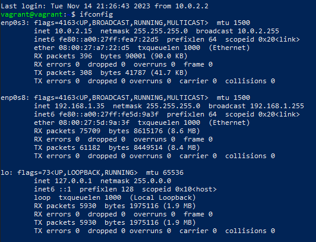

# CS510 Sepsis Prediction Project
## Quickstart guide

1. Download and install VirtualBox for your operating system
    - link: https://www.virtualbox.org/wiki/Downloads
    - If your computer runs Windows, choose "Windows hosts."
    - If your computer runs MacOS, choose "macOS/Intel hosts" (I haven’t tested this on mac yet)
    - If your computer runs Linux, choose "Linux distributions", then pick the appropriate distro
    - Run the installer and follow on-screen instructions
    - When done (you may be prompted to reboot), launch VirtualBox to check the installation
2. Download and install Vagrant
    - link: https://developer.hashicorp.com/vagrant/install?product_intent=vagrant
    - Download the version for your OS
        - You can choose between Mac, Windows, and Linux. I've only tested against windows and Ubuntu 22.04
3. Open PowerShell or a terminal window and navigate to the directory you cloned this repo from, and install the following plug-ins:
    - `vagrant plugin install vagrant-reload`
4. Move your MIMIC-III data into this directory
    - My script assumes this is a .rar archive named "MIMIC-III.rar". If it isn't exactly that, make changes to the VagrantFile on line 51 referencing the archive and add the necessary compression tools to the installation script on line 36 in the Vagrantfile.
5. Run `vagrant up` in that directory
    - This requires an internet connection to work, as the disk image your VM will be based on will need to be downloaded the first time this script runs
    - This will take a few minutes. The script should spawn a minimal ubuntu 22.04 virtual machines on your computer. 
    - It should be configured to get an IP address on the same network as your computer with a "bridged" interface
    - It should update and upgrade all installed software and build a new kernel version
    - It should install some useful tools
    - It should install Postgres, and configure it to accept connections from anywhere
    - It should install jupyterlab
    - It should copy in your MIMIC-III data
    - It should create the appropriate database within Postgres
    - It should inflate the data
    - It should build all the necessary tables needed within the databse, and verify database integrity with a few tests
6. You're all done with setup!

## Jupyter Notebook Access from Host Machine

If you're like me, youre gonna wanna use PySpark from a jupyter notebook on your host, instead of inside this GUI free VM. Here is how to get that working:

1. Run `vagrant ssh` from the Vagrantfile location, or use `ssh vagrant@<your VM's IP address>`
2. Login with your passowrd from above
3. launch jupyterlab by running `jupyter-lab --ip=<IP from above> --port=8888`
4. From your host machine, open a web browser and navigate to `<IP from above>:8888`
5. Use the token generated on the CLI output in your terminal or powershell session to log in through the UI
6. I've already included a pg_hba.conf file to allow you to connect from your host machine to the postgres instance

## Troubleshooting
1. Use vagrant to connect and invesitgate
    - run `vagrant ssh` from the terminal or PowerShell session in the directory you clones this repo to.
2. Change your password (if you havent already)
    - Run `passwd` 
    - Follow on-screen prompts
3. Make note of the IP address of the VM on the public interface
    - run `ifconfig` to get a report of all active network interfaces
    - Should be on interface "enp0s8"
    - In the example below, the IP we care about is 192.168.1.35, but will almost certainly be different for you

