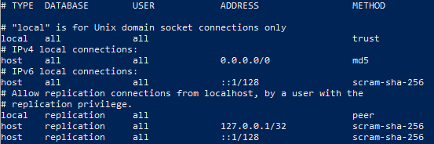

# CS510 Sepsis Prediction Project
 TODO: script more of this installation 
## Quickstart guide

1. Download and install VirtualBox for your operating system
    - link: https://www.virtualbox.org/wiki/Downloads
    - If your computer runs Windows, choose "Windows hosts."
    - If your computer runs MacOS, choose "macOS/Intel hosts" (I haven’t tested this on mac yet)
    - If your computer runs Linux, choose "Linux distributions", then pick the appropriate distro
    - Run the installer and follow on-screen instructions
    - When done (you may be prompted to reboot), launch VirtualBox to check the installation
2. Download and install Vagrant
    - link: https://developer.hashicorp.com/vagrant/install?product_intent=vagrant
    - Download the version for your OS
        - You can choose between Mac, Windows, and Linux. I've only tested against windows and Ubuntu 22.04
3. Open PowerShell or a terminal window and navigate to the directory you cloned this repo from
4. Run `vagrant up` in that directory
    - This requires an internet connection to work, as the disk image your VM will be based on will need to be downloaded the first time this script runs
    - This will take a few minutes. The script should spawn a minimal ubuntu 22.04 virtual machines on your computer. 
    - It should be configured to get an IP address on the same network as your computer with a "bridged" interface
    - It should update and upgrade all installed software and build a new kernel version
    - It should install some useful tools
    - It should install Postgres, and configure it to accept connections from anywhere
    - It should install jupyterlab
5. Connect to the spawned VM
    - run `vagrant ssh` from the terminal or PowerShell session you have open to connect to the VM
    - this command needs to be run from the same location as the Vagrantfile, otherwise vagrant will get confused and fail to connect
6. Change your password 
    - Run `passwd` 
    - Follow on-screen prompts
7. Make note of the IP address of the VM on the public interface
    - run `ifconfig` to get a report of all active network interfaces
    - Should be on interface "enp0s8"
    - In the example below, the IP we care about is 192.168.1.35, but will almost certainly be different for you

8. Reboot the VM
    - run `sudo reboot`
    - wait for the VM to reboot (should be less than a minute)
    - reconnect either with `vagrant ssh` or with `ssh vagrant@<your VM's IP address>` and your password from above
9. Check to see if Postgres is running
    - Run `systemctl status postgresql`
    - Green text is good, red text is bad
    - If it isnt running, try `systemctl restart postgresql`
10. Move the downloaded DB into the VM
    - Navigate to the directory that has the downloaded DB
    - use an scp command to move the file into the VM
    - using the IP address from above, the command would look like this:
        - `scp downloaded_db.zip vagrant@192.168.135:~/`
    - You will be prompted for the password you entered earlier
    - unzip or otherwise inflate the db
    - make note of the data location 
11. Import the DB data into Postgres
    - must be done with a valid Postgres role, default is "postgres"
    - change users to the appropriate one by running `sudo su - postgres`
    - connect to db by running `psql -U postgres`
    - create new db by running `CREATE DATABASE <database_name>;`. In our case, this is going to be `mimic`.
    - check if db was created by running `\list`
    - run `\q` to quit back to cli
    - begin to run the MIT approved procedure for inflating the database and creating the necessary tables
        - run `git clone https://github.com/MIT-LCP/mimic-code.git`
        - run `cd mimic-iii/buildmimic/postgres/`
        - run `make create-user mimic datadir="/path/to/data/"` where "/path/to/data/" is replaced with the directory of the data you loaded into the VM earlier
        - watch for build errors and wait for the process to complete. It may take upwards of a couple hours. 
    - You're all set. connect to the database using `psql -d mimic`, and be sure to set the schema to mimiciii by running `SET search_path TO mimiciii;` on the sql cli.

## Jupyter Notebook Access from Host Machine

If you're like me, youre gonna wanna use PySpark from a jupyter notebook on your host, instead of inside this GUI free VM. Here is how to get that working.

1. Run `vagrant ssh` from the Vagrantfile location, or use `ssh vagrant@<your VM's IP address>`
2. Login with your passowrd from above
3. launch jupyterlab by running `jupyter-lab --ip=<IP from above> --port=8888`
4. From your host machine, open a web browser and navigate to `<IP from above>:8888`
5. Use the token generated on the CLI to log in through the UI
6. You'll need to configure the postgres server to accept connections from your host machine (or anywhere, if you don't care about inbound connections) if you havent already. Note: this connection method is not for production and is insecure. 
    - modify `/etc/postgresql/14/main/pg_hba.conf` to resemble the following:

